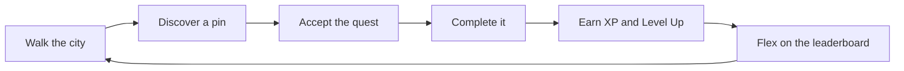
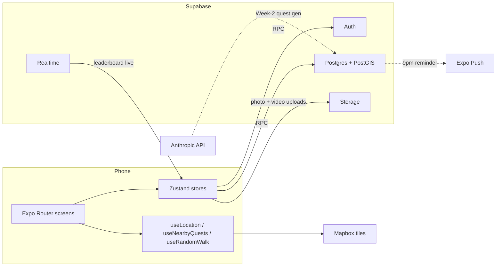
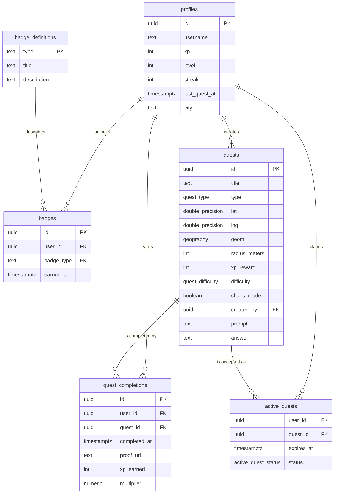

<div align="center">

# NomadGo

### Walk the City. Complete the Quests. Become Legend.

**Pokemon GO meets real-world quests.** Your city is the game board. Your legs are the controller. Your brain is the joystick.

`React Native` `Expo Router` `Supabase` `PostGIS` `Zustand` `Reanimated v3`

</div>

---

## Contents

1. [What is NomadGo](#what-is-nomadgo)
2. [Core loop](#core-loop)
3. [Feature highlights](#feature-highlights)
4. [Tech stack](#tech-stack)
5. [Architecture](#architecture)
6. [The eight screens](#the-eight-screens)
7. [Quick start](#quick-start)
8. [Project layout](#project-layout)
9. [Database schema](#database-schema)
10. [Quest types](#quest-types)
11. [Chaos Mode](#chaos-mode)
12. [Roadmap](#roadmap)
13. [Demo-day checklist](#demo-day-checklist)
14. [Credits](#credits)
15. [License](#license)

---

## What is NomadGo

University students are stuck in a loop: library → phone → repeat. Study groups are boring. Learning feels disconnected from the real world. Social apps don't make you move.

**NomadGo fixes this by making the city itself the game board.** Your campus becomes a dungeon. The library entrance is a boss room. The gym is a power-up zone. Studying becomes an adventure.

> Pokemon GO — but instead of catching imaginary creatures, you complete real tasks in your actual city. Walk, discover, complete, and level up as an explorer. Studying, fitness, and urban adventure all in one app — and yes, there's a quest that makes you stand still like a mime for 60 seconds.

| User                  | Motivation                                          | Example quest                                                          |
| --------------------- | --------------------------------------------------- | ---------------------------------------------------------------------- |
| CS students           | Solve coding challenges at specific campus spots    | Recursion puzzle at the CS fountain in under 5 minutes                  |
| Fitness-first         | XP from distance + physical tasks                   | 20 pull-ups at the outdoor bars to unlock the Athlete badge             |
| Explorers / tourists  | Discover hidden city spots with history trivia      | Find the rooftop mural — what year was it painted?                      |
| Competitive gamers    | Climb leaderboards and collect rare quest chains    | Complete the 5-quest Summer Series before anyone in your city           |

---

## Core loop



Every step is something **moving on screen** — the pulse on a nearby pin, the XP fly-up after completion, your name climbing the leaderboard in real time. The loop is the product.

---

## Feature highlights

- **Six quest types** anchored to GPS coordinates — Scan, Trivia, Photo, Puzzle, Social, Boss
- **XP + Levels** with a five-tier rank ladder from Street Rookie to NomadGo Master
- **Daily streaks** with a multiplier curve — 1x to 3x at day 14, reset on miss
- **Chaos Mode** drops absurd joke quests alongside real ones — 99% of viral screenshots
- **City leaderboards** with realtime updates via Supabase Realtime
- **Badge system** with eleven achievements tied to milestones, streaks, and quest types
- **Boss Quests** that unlock after five nearby completions, with 3x larger map pins and a flame effect
- **Polished dark theme** with neon-purple accents and quest-type color coding

---

## Tech stack

| Layer               | Technology                              | Why                                                                      |
| ------------------- | --------------------------------------- | ------------------------------------------------------------------------ |
| Mobile shell        | React Native 0.74 + Expo 51             | Single codebase, fast iteration with Expo Go for JS-only screens         |
| Navigation          | Expo Router (file-based)                | Next.js-style mental model, typed routes                                 |
| State               | Zustand + AsyncStorage persistence      | Tiny, no boilerplate; perfect for a hackathon sprint                     |
| Animation           | Reanimated v3                           | 60fps XP pop-ups, pin pulses, level-up sequences                         |
| Map (Tier 2)        | `@rnmapbox/maps`                        | Free tier, custom styles, clustering, real-time GPS                      |
| Map (Tier 1, today) | Hand-rolled styled `View` projection    | Zero native deps, runs in Expo Go for the demo                           |
| Backend             | Supabase (Postgres + PostGIS + Realtime)| Auth + DB + realtime + storage in one — zero backend code                |
| Geo queries         | PostGIS `ST_DWithin`                    | Indexed radius search for "what's near me" in milliseconds               |
| Verification        | `expo-camera` (`CameraView`)            | QR scanning + photo capture with EXIF GPS metadata                       |
| Push                | Expo Notifications                      | Streak reminders, quest-unlock alerts, boss announcements                |
| AI (Week-2)         | Anthropic API                           | Auto-generate trivia/puzzle content for any GPS coord                    |

---

## Architecture



Six core tables, six RPC functions, three triggers, one materialized leaderboard view — all migrations committed in [`nomadgo/supabase/migrations/`](nomadgo/supabase/migrations/).

---

## The eight screens

| Tab        | Screen                  | What you do there                                                              |
| ---------- | ----------------------- | ------------------------------------------------------------------------------ |
| Auth       | OnboardingScreen        | Three-slide intro, pick username and city, persisted to AsyncStorage           |
| Map        | MapScreen               | Live canvas of quest pins around you, pulse animation on nearby ones, FAB to create |
| Map        | QuestDetailSheet        | Slides up on pin tap — title, type, XP, distance, accept button                |
| Map        | ActiveQuestScreen       | HUD with timer, live distance, objective, type-specific verification prompts   |
| Map        | QuestCompleteScreen     | XP fly-up, level-up modal if you crossed a threshold, share button             |
| Quests     | QuestFeedScreen         | All quests sorted by distance, filterable by type                              |
| Profile    | ProfileScreen           | Avatar, XP bar, rank, streak, badge grid (earned + locked), settings, chaos toggle |
| Root       | LeaderboardScreen       | Top 10 in your city, your row highlighted, Today / Week / All-Time tabs        |

---

## Quick start

```bash
cd nomadgo
npm install
cp .env.example .env   # blank values are fine — runs against the in-memory mock store
npx expo start
```

Then press `i` for iOS sim, `a` for Android emulator, or `w` for web. Scan the QR with the Expo Go app on your phone for a real device.

To wire the real backend (Tier 2), fill `.env` with a Supabase URL + anon key and a Mapbox token, then:

```bash
npx supabase db push                                # applies six migrations
psql "$SUPABASE_DB_URL" -f nomadgo/supabase/seed.sql # 20 quests + 11 badges

eas build --profile development --platform android  # required for @rnmapbox/maps
npx expo start --dev-client
```

---

## Project layout

```
nomad-go-cursor-hackaton/
├── QuestCity_Documentation.docx     # Source-of-truth spec
├── README.md                         # You are here
└── nomadgo/                          # Expo app
    ├── app/                          # Expo Router screens (file-based)
    │   ├── _layout.tsx               # Root: auth gate, providers, XpFlyUp
    │   ├── (auth)/onboarding.tsx
    │   ├── (tabs)/
    │   │   ├── _layout.tsx           # Bottom tabs Map / Quests / Profile
    │   │   ├── index.tsx             # MapScreen
    │   │   ├── quests.tsx            # QuestFeedScreen
    │   │   └── profile.tsx           # ProfileScreen
    │   ├── quest/
    │   │   ├── [id].tsx              # ActiveQuestScreen
    │   │   ├── complete.tsx          # QuestCompleteScreen
    │   │   └── create.tsx            # CreateQuestScreen (Lvl 10+ gate)
    │   └── leaderboard.tsx
    ├── src/
    │   ├── components/
    │   │   ├── map/                  # PlaceholderMap, PulsingPin, QuestDetailSheet
    │   │   ├── quest/                # QuestCard, QuestTypeIcon
    │   │   ├── profile/              # XpFlyUp
    │   │   └── ui/                   # Button, Card, Text, Pill, ProgressBar
    │   ├── stores/                   # Zustand: player, quest, location, settings
    │   ├── hooks/                    # useRandomWalk (demo GPS drift)
    │   ├── lib/                      # supabase, env, distance, data layer
    │   ├── data/                     # mockQuests, mockLeaderboard
    │   ├── mocks/                    # Seed quest data
    │   ├── theme/                    # colors, typography, spacing
    │   └── types/                    # quest, profile, badge
    ├── supabase/
    │   ├── migrations/
    │   │   ├── 001_schema.sql        # 6 tables + PostGIS
    │   │   ├── 002_rls.sql           # Row-Level Security
    │   │   ├── 003_functions.sql     # 6 RPCs from doc Section 7.1
    │   │   ├── 004_triggers.sql      # Level-up + badge triggers
    │   │   ├── 005_views.sql         # Materialized leaderboard_view
    │   │   └── 006_week2.sql         # Teams, expiry, seasonal, social feed
    │   └── seed.sql                  # 11 badges + 20 quests
    ├── assets/                       # Icon, splash, favicon
    ├── app.config.ts                 # Expo config + plugin list
    ├── eas.json                      # dev-client + preview build profiles
    ├── .env.example
    ├── tsconfig.json
    ├── babel.config.js
    └── package.json
```

---

## Database schema



Six RPC functions handle all game logic server-side: `nearby_quests`, `accept_quest`, `complete_quest`, `award_xp`, `get_leaderboard`, `create_quest`. See [`nomadgo/supabase/migrations/003_functions.sql`](nomadgo/supabase/migrations/003_functions.sql).

---

## Quest types

| Type    | Icon  | How it works                                                                          | XP reward | Difficulty  |
| ------- | ----- | ------------------------------------------------------------------------------------- | --------- | ----------- |
| Scan    | QR    | Walk to location, scan a hidden QR code to prove presence (codes rotate weekly)       | 50        | Easy        |
| Trivia  | ?     | Arrive at location, answer a question about its history, science or culture           | 100       | Medium      |
| Photo   | CAM   | Capture an image matching the criteria, EXIF GPS validated server-side                | 150       | Medium      |
| Puzzle  | GEAR  | Solve a riddle whose answer is only discoverable at the location                      | 200       | Hard        |
| Social  | PPL   | Complete a task requiring interaction with strangers, photo proof required            | 250       | Hard        |
| Boss    | SKULL | Multi-step epic unlocked only after completing 5 normal quests nearby                 | 1000      | Legendary   |

### XP + level progression

| Level | Rank             | XP required | Perk unlocked                                  |
| ----- | ---------------- | ----------- | ---------------------------------------------- |
| 1     | Street Rookie    | 0           | Basic quests visible on map                    |
| 5     | Urban Scout      | 500         | See quest hints before arrival                 |
| 10    | City Hunter      | 1,500       | Create custom quests for others                |
| 20    | District Legend  | 5,000       | Unlock Boss Quests                             |
| 50    | NomadGo Master   | 25,000      | Hall of Fame + permanent bragging rights       |

### Streak multipliers

| Streak    | Multiplier | Bonus                                          |
| --------- | ---------- | ---------------------------------------------- |
| Day 1     | 1x         | Normal XP                                      |
| Day 3     | 1.5x       | Quests glow on the map                         |
| Day 7     | 2x         | Unlock a Secret Quest                          |
| Day 14    | 3x         | Username turns gold on the leaderboard         |
| Miss      | reset      | The app sends one passive-aggressive reminder  |

---

## Chaos Mode

The built-in **Chaos Mode** drops joke quests alongside the real ones. They're optional, hilarious, and generate 99% of the screenshots that go viral.

| Quest                         | What it makes you do                                                                                          |
| ----------------------------- | ------------------------------------------------------------------------------------------------------------- |
| **The Mime Quest**            | Stand completely still at the city fountain for 60 seconds. Phone timer verifies. Passersby will be confused. |
| **The Invisible Walk**        | Walk from point A to B as slowly as humanly possible. Under 0.5 km/h for the full route = complete.            |
| **The Reverse Quest**         | Walk the route backwards. Literally. Rear-facing camera activates for proof.                                  |
| **The NPC Quest**             | Say "Have you heard of the Elder Scrolls?" to a stranger and get them to respond. Photo proof required.        |
| **The Calisthenics Drop**     | GPS locates the nearest outdoor bar. Do a muscle-up. Selfie video required. 500 XP because it's genuinely hard. |

Toggle Chaos Mode on or off in the Profile screen. When enabled, chaos pins glow yellow on the map.

---

## Roadmap

### Shipped today (1-day hackathon MVP)

- [x] Project scaffold, design system, app icon and splash
- [x] Onboarding (3 slides + city + name)
- [x] Map screen with pulsing pins, range rings, animated player dot
- [x] Quest detail sheet, active quest HUD, completion flow with XP fly-up
- [x] Profile with XP bar, rank, streak, badge grid, chaos toggle
- [x] Quest feed with type filters
- [x] Leaderboard with 8 funny seeds
- [x] Streak multiplier logic (1x → 1.5x → 2x → 3x)
- [x] Full Supabase schema, RLS, RPCs and triggers committed as architecture artifacts

### Tier 2 (post-demo, same week)

- [ ] Swap PlaceholderMap for `@rnmapbox/maps` with a custom dark style
- [ ] Wire real Supabase auth (magic link + Google OAuth)
- [ ] Replace `useRandomWalk` with `expo-location` continuous tracking
- [ ] QR scanner via `expo-camera` `CameraView`
- [ ] Photo + 5–10s video capture with EXIF GPS validation
- [ ] Push notifications: 9pm streak reminder, boss-unlock, quest-nearby
- [ ] Realtime leaderboard subscription

### Week-2 extensions (deferred — schema already lives in `006_week2.sql`)

- [ ] **Team Quests** — 2–4 person parties, multi-role completion checks
- [ ] **City vs City** leaderboards — rivalry cards across universities
- [ ] **AI Quest Generation** — Anthropic API drafts trivia for any GPS coord
- [ ] **Quest Expiry** — 1-hour quests with 15-min-before push notifications
- [ ] **Seasonal Events** — Summer Series chain, Exam Week chaos pack
- [ ] **Social Feed** — see what your friends just completed

---

## Demo-day checklist

For the live three-minute pitch:

1. Open the app to the Map. Pre-seed 5 quests within 200m of the demo table. Show the nearest pin pulsing.
2. Tap the pin. The detail sheet slides up. Hit **Accept Quest**.
3. The HUD shows. Read the objective out loud — make it funny.
4. Hit **Complete Quest**. Watch the XP fly-up animation. If timed right, the level-up modal fires.
5. Open the **Leaderboard** tab. Eight funny seeded names are there with your row highlighted.
6. Switch to **Profile**. Toggle **Chaos Mode** on. Show one of the five chaos quests by name.
7. Hit **Share my run** to show the share-card slot.

**Pre-demo checks**
- [ ] Set your profile to Level 19 via the Profile screen's "Set Demo State" button so the level-up fires on the next quest
- [ ] Enable Chaos Mode so the yellow chaos pins appear on the map
- [ ] Have a backup screen recording ready in case WiFi fails
- [ ] Charge the demo phone to >70%

---

## Credits

Built for **Summer Hackathon 2026** by a 3-person team:

- **Member 1** — Map, GPS, quest verification, XP animations (frontend lead)
- **Member 2** — Supabase schema, auth, XP system, streaks, leaderboard, push (backend lead)
- **Member 3** — Profile, leaderboard UI, quest feed, quest creator, chaos mode, polish (product lead)

Source-of-truth spec: [`QuestCity_Documentation.docx`](QuestCity_Documentation.docx) (the original product brief — the brand evolved into NomadGo during development; the spec content stands).

---

## License

MIT — go walk a city.

---

<div align="center">

**NomadGo** — *Walk the city. Complete the quests. Become legend.*

</div>
